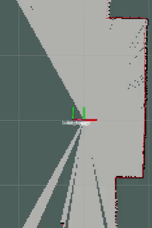
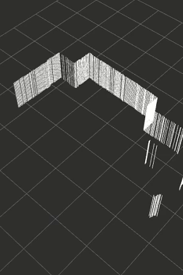

# occupancy_to_pointcloud

This package provides a ROS node to convert a 2D occupancy map from a LIDAR scan into a 3D point cloud. This point cloud can then be used to create a 3D Octomap. The program reads an OccupancyGrid map from the `/map` topic, converts it into a point cloud, and publishes the point cloud on the `/cloud_out` topic.

The occupancy grid cells are interpreted as 2D slices of the 3D environment. Each occupied cell is transformed into a vertical column of points, with a specified density of points along the z-axis.

  



## Dependencies

- ROS Melodic or Noetic (other versions may work but were not tested)
- pcl_conversions ROS package

## Installation

1. First, navigate to the source directory of your catkin workspace:

    ```bash
    cd ~/catkin_ws/src
    ```

2. Clone this repository into your catkin workspace:

    ```bash
    git clone https://github.com/snakehaihai/occupancy_to_pointcloud.git
    ```

3. From your catkin workspace directory, use `catkin_make` to compile the package:

    ```bash
    cd ~/catkin_ws
    catkin_make
    ```

4. Don't forget to source your workspace's setup script after building the package:

    ```bash
    source devel/setup.bash
    ```

## Usage

You can run the `occupancy_to_pointcloud_node` using the `rosrun` command:

```bash
roslaunch laser_scan_matcher demo_gmapping.launch
rosrun occupancy_to_pointcloud occupancy_to_pointcloud_node

```

Copyright (c) 2023 Your Name

Permission is hereby granted, free of charge, to any person obtaining a copy
of this software and associated documentation files (the "Software"), to deal
in the Software without restriction, including without limitation the rights
to use, copy, modify, merge, publish, distribute, sublicense, and/or sell
copies of the Software, and to permit persons to whom the Software is
furnished to do so, subject to the following conditions:

The above copyright notice and this permission notice shall be included in all
copies or substantial portions of the Software.

THE SOFTWARE IS PROVIDED "AS IS", WITHOUT WARRANTY OF ANY KIND, EXPRESS OR
IMPLIED, INCLUDING BUT NOT LIMITED TO THE WARRANTIES OF MERCHANTABILITY,
FITNESS FOR A PARTICULAR PURPOSE AND NONINFRINGEMENT. IN NO EVENT SHALL THE
AUTHORS OR COPYRIGHT HOLDERS BE LIABLE FOR ANY CLAIM, DAMAGES OR OTHER
LIABILITY, WHETHER IN AN ACTION OF CONTRACT, TORT OR OTHERWISE, ARISING FROM,
OUT OF OR IN CONNECTION WITH THE SOFTWARE OR THE USE OR OTHER DEALINGS IN THE
SOFTWARE.
